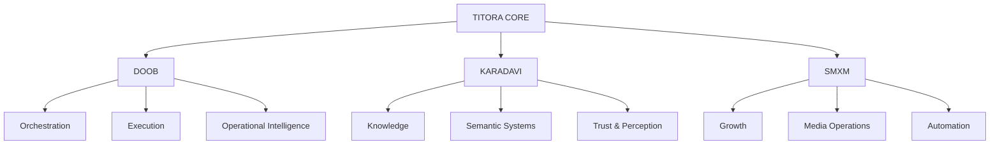

<div align="center">


# TITORA

**Intelligence infrastructure for interconnected digital systems.**

<p>
  <a href="https://github.com/aruntito/titora">Repository</a> ·
  <a href="https://github.com/aruntito/doob-public-architecture">DOOB</a> ·
  <a href="https://github.com/aruntito/doob-queue-systems">DOOB Queue Systems</a>
</p>

</div>

---

## What is TITORA?

TITORA is the umbrella architecture and research layer behind a set of interconnected systems for **orchestration, intelligence, semantic knowledge, growth operations, automation, and execution**.

It is not intended to be another standalone SaaS product. This repository acts as the **system map, architectural index, and documentation entry point** for the ecosystem.

> Digital products become more useful when their intelligence, execution, knowledge, and operational infrastructure can work as connected systems rather than isolated applications.

## Ecosystem



### Core systems

| System | Role | Direction |
| --- | --- | --- |
| **DOOB** | Growth intelligence & orchestration | Connect signals, goals, providers, execution, and operational workflows. |
| **KARADAVI** | Knowledge & semantic infrastructure | Build structured, editorially controlled knowledge and connected concepts. |
| **SMXM** | Growth & media operations | Build systems for marketing, distribution, media execution, and scalable growth operations. |

TITORA provides the **system-level context**. Individual products can evolve independently while remaining connected through shared architectural principles.

---

## Architecture principles

### Systems over isolated features
Features should belong to a coherent system with clear ownership, boundaries, and operational purpose.

### Intelligence must lead to execution
Data, signals, models, and knowledge are useful when they improve a decision, workflow, or measurable outcome.

### Explicit boundaries
Each system should have a clear responsibility. Avoid turning the ecosystem into a single tightly coupled application.

### Human control where it matters
Automation can accelerate execution, but consequential publishing, destructive operations, and editorial decisions should have explicit controls and approval boundaries.

### Observable by default
Operational systems should expose useful state, failures, events, and execution history rather than relying on hidden behavior.

### Durable infrastructure
Prefer simple primitives, documented contracts, replay-safe workflows, idempotent operations, and replaceable providers over fragile integrations.

---

## Development directions

- **Distributed systems** — service boundaries, queues, workers, and execution coordination
- **Operational intelligence** — signals, state, telemetry, and decision support
- **Orchestration** — coordinating goals, providers, workflows, and execution
- **Semantic infrastructure** — entities, relationships, canonical concepts, and knowledge graphs
- **Automation** — repeatable workflows with explicit controls and observability
- **Growth infrastructure** — acquisition, distribution, media operations, and measurement
- **Scalable execution** — turning intent into reliable, traceable operations

These are architectural directions, not claims that every layer is already production-complete.

---

## Repository role

This repository intentionally stays lightweight.

It should contain:

- ecosystem-level architecture
- system boundaries and responsibilities
- technical principles
- cross-project decisions
- public documentation
- links to implementation repositories

Implementation code belongs in the individual system repositories unless there is a strong reason for it to live here.

```text
titora/
├── assets/
├── docs/
│   ├── architecture.md
│   └── roadmap.md
├── .github/
├── CONTRIBUTING.md
├── SECURITY.md
├── LICENSE
└── README.md
```

---

## Roadmap

### Foundation
- [x] Establish TITORA as the ecosystem-level repository
- [x] Define the primary system boundaries
- [x] Publish the public architecture index
- [ ] Expand cross-system architecture documentation

### Infrastructure
- [ ] Define common event and execution concepts
- [ ] Document observability and operational conventions
- [ ] Define integration and provider boundary patterns
- [ ] Document security boundaries and trust assumptions

### Intelligence
- [ ] Map signal → decision → execution flows
- [ ] Document semantic/entity infrastructure
- [ ] Define cross-system knowledge and context boundaries

### Ecosystem
- [ ] Publish system-level architecture diagrams
- [ ] Link production and public implementation repositories
- [ ] Maintain architecture decision records
- [ ] Establish release/change documentation

---

## Related projects

- [DOOB Public Architecture](https://github.com/aruntito/doob-public-architecture)
- [DOOB Queue Systems](https://github.com/aruntito/doob-queue-systems)

## Contributing

TITORA is primarily an architecture and documentation hub.

Read [CONTRIBUTING.md](./CONTRIBUTING.md) before proposing changes.

For security issues, follow [SECURITY.md](./SECURITY.md).

---

<div align="center">

**Operational ecosystems · Intelligence infrastructure · Scalable digital systems**

Built and maintained by **Arun Dharavath**

</div>
