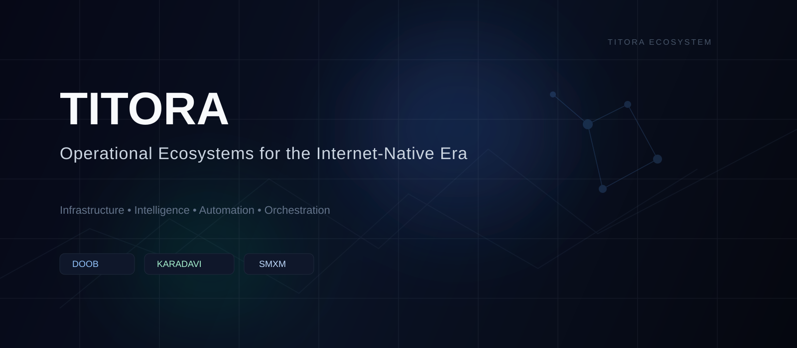

<div align="center">



</div>

---

# Ecosystem Overview

TITORA operates as a multi-layer operational ecosystem focused on intelligence infrastructure, distributed systems, automation environments, semantic systems, growth operations, and scalable execution coordination.

The ecosystem combines orchestration systems, semantic intelligence, automation frameworks, media execution, and scalable internet-native operational environments into interconnected digital systems.

---

# Ecosystem Architecture

```text
TITORA
 ├─ DOOB
 │   ├─ Distributed orchestration
 │   ├─ Queue coordination
 │   ├─ Provider infrastructure
 │   └─ Execution intelligence
 │
 ├─ KARADAVI
 │   ├─ Machine trust
 │   ├─ Semantic authority
 │   ├─ Perception infrastructure
 │   └─ AI discoverability
 │
 ├─ SMXM
 │   ├─ Growth systems
 │   ├─ Media operations
 │   ├─ Automation workflows
 │   └─ Digital scaling
 │
 └─ TITORA CORE
     ├─ Operational ecosystems
     ├─ Infrastructure intelligence
     ├─ Automation systems
     └─ Coordination architecture
```

---

# Core Operational Areas

| System | Direction |
| --- | --- |
| Intelligence Infrastructure | Structured operational intelligence systems |
| Automation Ecosystems | Workflow orchestration and automation environments |
| Distributed Operations | Coordinated execution infrastructure |
| Semantic Systems | Contextual and machine-readable intelligence |
| Digital Scaling | Multi-platform operational expansion |
| Operational Coordination | Infrastructure-level execution management |

---

# Philosophy

> Modern digital organizations increasingly operate as interconnected systems rather than isolated products.

TITORA explores infrastructure, orchestration, intelligence systems, semantic environments, automation coordination, and scalable execution ecosystems.

---

# Ecosystem Divisions

## DOOB
Distributed orchestration infrastructure and operational intelligence.

## KARADAVI
Machine trust, semantic authority, and perception infrastructure.

## SMXM
Growth systems, media operations, and scalable execution environments.

---

# Infrastructure Direction

- distributed systems
- operational intelligence
- orchestration environments
- semantic infrastructure
- automation coordination
- scalable execution systems
- intelligence ecosystems
- internet-native operations

---

<div align="center">

Operational ecosystems • Intelligence infrastructure • Scalable digital systems

</div>
