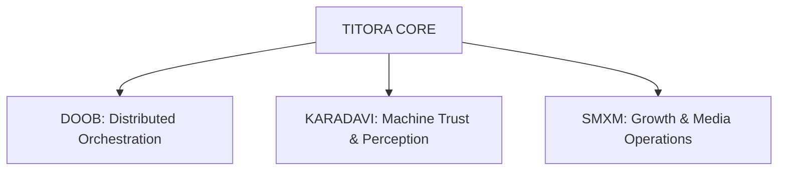

---

## Overview

TITORA operates as a multi-layer operational ecosystem focused on intelligence infrastructure, distributed systems, automation environments, semantic systems, growth operations, and scalable execution coordination.

The ecosystem combines orchestration systems, semantic intelligence, automation frameworks, media execution, and scalable internet-native operational environments into interconnected digital systems.

## Why this repository exists

> Modern digital organizations increasingly operate as interconnected systems rather than isolated products.

This repository serves as the central hub and documentation entry point for the TITORA ecosystem, exploring infrastructure, orchestration, intelligence systems, semantic environments, automation coordination, and scalable execution ecosystems.

## Architecture

## Core Components

| System | Direction |
| --- | --- |
| **DOOB** | Distributed orchestration infrastructure and operational intelligence. |
| **KARADAVI** | Machine trust, semantic authority, and perception infrastructure. |
| **SMXM** | Growth systems, media operations, and scalable execution environments. |

## Development & Infrastructure Direction

- distributed systems
- operational intelligence
- orchestration environments
- semantic infrastructure
- automation coordination
- scalable execution systems
- intelligence ecosystems
- internet-native operations

## Related Projects

- [DOOB Public Architecture](https://github.com/aruntito/doob-public-architecture)
- [DOOB Queue Systems](https://github.com/aruntito/doob-queue-systems)

---

Operational ecosystems • Intelligence infrastructure • Scalable digital systems

