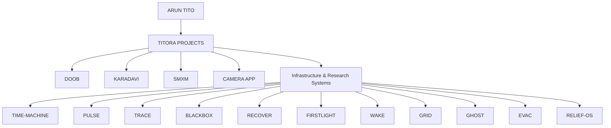

<div align="center">


# TITORA

**Arun Tito's personal technology project ecosystem.**

<p>Independent systems · Research · Infrastructure · Product experiments</p>

</div>

---

## What is TITORA?

**TITORA is the umbrella identity for Arun Tito's personal technology projects.**

This repository is an index and public map of the systems I build, research, and experiment with across software, AI, infrastructure, growth, knowledge, resilience, and operational systems.

The projects are **independent**. They are not one monolithic platform, and they do not need to become one.

Some projects have conceptual relationships with each other, but each project should remain independently useful, understandable, and maintainable.

> **Build systems that make complex environments observable, understandable, and actionable.**

That is a recurring thesis across the infrastructure and resilience projects, not a claim that every TITORA project solves the same problem.

---

## The TITORA Project Map



### Product / platform projects

| Project | Focus |
| --- | --- |
| **DOOB** | Growth intelligence, orchestration, signals, goals, providers, and execution. |
| **KARADAVI** | Knowledge, entities, semantic relationships, and editorially controlled understanding. |
| **SMXM** | Growth, marketing, media operations, and distribution systems. |
| **CAMERA APP** | Creator-focused camera, recording, project organization, and teleprompter workflow. |
| **TITORA** | The personal project ecosystem, identity, and public architecture index. |

### Infrastructure & research systems

| Project | Core question |
| --- | --- |
| **TIME-MACHINE** | How did we get here? |
| **PULSE** | What just changed? |
| **TRACE** | Why did it change? |
| **BLACKBOX** | What actually happened? |
| **RECOVER** | How do we get back to a known-good state? |
| **FIRSTLIGHT** | What should happen first? |
| **WAKE** | Who needs to act? |
| **GRID** | What is connected to what? |
| **GHOST** | What exists that we don't know about? |
| **EVAC** | How does a system respond under pressure? |
| **RELIEF-OS** | How do we allocate help effectively? |

---

## The 11-system resilience family

The 11 infrastructure/research projects are deliberately separate systems.

Their primary conceptual chain is:

```text
TIME-MACHINE
      ↓
    PULSE
      ↓
    TRACE
      ↓
  BLACKBOX
      ↓
   RECOVER
      ↓
 FIRSTLIGHT
      ↓
     WAKE
```

Two systems provide infrastructure context:

- **GRID** — dependency topology and relationships
- **GHOST** — unknown, orphaned, and inventory discrepancies

Two systems explore resilience and research:

- **EVAC** — simulation and response under pressure
- **RELIEF-OS** — resource allocation and logistics

This is an architectural relationship, **not a requirement to merge the repositories or create a distributed monolith**.

---

## Shared engineering principles

### Independent boundaries

Every project should have a clear mission, explicit inputs and outputs, domain-specific semantics, testable behavior, identifiable failure modes, and independent usefulness.

### Evidence before certainty

Systems dealing with observation, history, incidents, or investigation should preserve provenance, confidence, uncertainty, missing information, and conflicting evidence.

### Facts vs interpretation

A system should not silently turn:

- correlation into causation
- observation into explanation
- notification into ownership
- unknown into malicious intent
- simulation into prediction
- attempted recovery into verified recovery

### Integration only where justified

Projects may eventually communicate through explicit contracts, but conceptual similarity alone is not sufficient reason to couple them.

Prefer explicit contracts, strong domain models, deterministic behavior where practical, observable state, reproducibility, explainability, verification, and graceful failure.

Avoid unnecessary distributed-system complexity.

---

## Development model

The 11 infrastructure projects are being approached in conceptual waves:

### Wave 1
- PULSE
- GRID
- TRACE

### Wave 2
- BLACKBOX
- RECOVER
- WAKE
- FIRSTLIGHT

### Wave 3
- GHOST
- TIME-MACHINE

### Wave 4
- EVAC
- RELIEF-OS

The waves represent architecture and dependency thinking. They do **not** mean implementation of one repository must literally block another.

---

## Public vs private engineering

The public GitHub repositories are intended to remain clean public surfaces for architecture, research, documentation, and source code.

Detailed implementation context may remain local.

The intended private engineering layer is:

```text
AGENTS.md

.agent/
├── requirements.md
├── data-model.md
├── interfaces.md
├── invariants.md
└── implementation.md
```

These files are for local development and agent context.

**.gitignore is not a security boundary.** Private information should never be placed in a repository merely because it is ignored by Git.

The private engineering layer should only be published when explicitly intended.

---

## ChatGPT + Antigravity workflow

Each major project has its own ChatGPT Project with **Project-only memory**.

The division of responsibility is:

```text
CHATGPT PROJECT
Architecture
Research
Requirements
Domain modeling
Design decisions
Failure analysis
Implementation planning
        │
        ▼
ANTIGRAVITY
Local repository inspection
Implementation
Testing
Verification
Cleanup
        │
        ▼
GITHUB
Public source
Architecture
Research
Documentation
```

When the local repository is eventually provided to Antigravity, the corresponding ChatGPT Project should first understand the actual repository state before generating implementation instructions.

The final Antigravity instruction should be **one coherent, project-specific execution prompt**, based on the real repository rather than assumptions.

---

## What this repository is not

TITORA is **not**:

- a claim that all projects are one platform
- a monolithic codebase
- a replacement for the individual repositories
- proof that every documented system is production-ready
- a reason to introduce unnecessary cross-project infrastructure

It is a public map of a personal project ecosystem.

---

## Documentation

- [Project map](docs/projects.md) — project inventory and core questions
- [Architecture](docs/architecture.md) — ecosystem boundaries and conceptual relationships
- [Roadmap](docs/roadmap.md) — evolution of the TITORA index
- [Status](docs/status.md) — status vocabulary and verification rules
- [Architecture decisions](docs/decisions/) — decisions that define ecosystem boundaries
- [Changelog](CHANGELOG.md) — changes to this public TITORA repository

For contribution and governance guidance, see [CONTRIBUTING.md](CONTRIBUTING.md), [SECURITY.md](SECURITY.md), [SUPPORT.md](SUPPORT.md), and [CODE_OF_CONDUCT.md](CODE_OF_CONDUCT.md).

## Projects

### Core projects

- **CAMERA APP** — planned creator-focused camera and recording project
- **DOOB** — separate project; public architecture surfaces are linked below
- **KARADAVI** — separate project; public entry surface: [enterKARADAVI](https://github.com/aruntito/enterkaradavi)
- [SMXM](https://github.com/aruntito/smxm)
- [TITORA](https://github.com/aruntito/titora)

### Public implementation / architecture surfaces

- [DOOB Architecture Console](https://github.com/aruntito/doob-architecture-console)
- [DOOB Observability](https://github.com/aruntito/doob-observability)
- [enterKARADAVI](https://github.com/aruntito/enterkaradavi)
- [SMXM](https://github.com/aruntito/smxm)

These links are public surfaces that can be verified. TITORA does not assume that a public surface represents the complete implementation of the corresponding project.

### Infrastructure & research

- [TIME-MACHINE](https://github.com/aruntito/time-machine)
- [PULSE](https://github.com/aruntito/pulse)
- [TRACE](https://github.com/aruntito/trace)
- [BLACKBOX](https://github.com/aruntito/blackbox)
- [RECOVER](https://github.com/aruntito/recover)
- [FIRSTLIGHT](https://github.com/aruntito/firstlight)
- [WAKE](https://github.com/aruntito/wake)
- [GRID](https://github.com/aruntito/grid)
- [GHOST](https://github.com/aruntito/ghost)
- [EVAC](https://github.com/aruntito/evac)
- [RELIEF-OS](https://github.com/aruntito/relief-os)

---

<div align="center">

**TITORA · Personal technology projects by Arun Tito**

</div>
