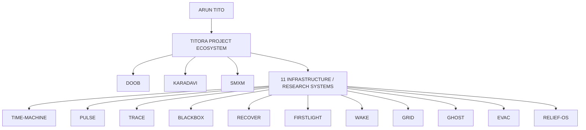
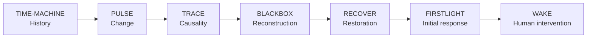

# TITORA Architecture

## Purpose

TITORA is the personal project ecosystem and public architecture index for Arun Tito's independent technology projects.

It is a federation of projects, not a monolith.

## System map



## Architecture layers

### Personal ecosystem layer

**TITORA** provides identity, project discovery, public documentation, and cross-project architectural context.

It should not become a shared implementation repository.

### Independent product systems

**DOOB, KARADAVI, and SMXM** are independent projects with their own product boundaries and implementation decisions.

TITORA may document their relationship but does not own their internal architecture.

### Infrastructure and research family

The 11 systems explore observation, investigation, response, recovery, topology, discovery, simulation, and logistics.

They share principles, not necessarily code.

## Reasoning chain



## Context systems

- **GRID** provides dependency and topology context.
- **GHOST** provides unknown, orphaned, and inventory context.
- **EVAC** explores simulation and resilience.
- **RELIEF-OS** explores resource allocation and logistics.

These are contextual relationships, not defined runtime dependencies.

## Boundary rules

### Each project owns its domain

A project should own the concepts, state transitions, invariants, and interfaces specific to its mission.

### Cross-project integration requires a contract

Before integration, document purpose, owner, input contract, output contract, failure behavior, versioning, trust boundary, observability, and retry/idempotency behavior.

### Do not centralize by default

Shared code is not automatically shared architecture. If a common abstraction is still evolving, keeping it inside the owning project is usually safer than creating a premature platform dependency.

### Preserve epistemic boundaries

Systems dealing with evidence and uncertainty must distinguish observation, evidence, interpretation, hypothesis, decision, action, and outcome.

A downstream system must not silently upgrade uncertainty into fact.

## Public/private boundary

Public repositories may describe architecture, research, source code, and intended direction.

Detailed agent instructions and implementation context may remain local:

```text
AGENTS.md
.agent/
├── requirements.md
├── data-model.md
├── interfaces.md
├── invariants.md
└── implementation.md
```

Ignored files are not a security mechanism. Secrets and sensitive material must never be protected merely by .gitignore.

## Architecture decision records

Material cross-project decisions should be recorded in docs/decisions/.

Each decision should state:

1. Context
2. Decision
3. Alternatives considered
4. Consequences
5. Revisit conditions

## Evolution rule

Change an architectural boundary when there is a concrete problem involving correctness, reliability, security, maintainability, or operational cost.

Do not create coupling just because two project names appear in the same diagram.
