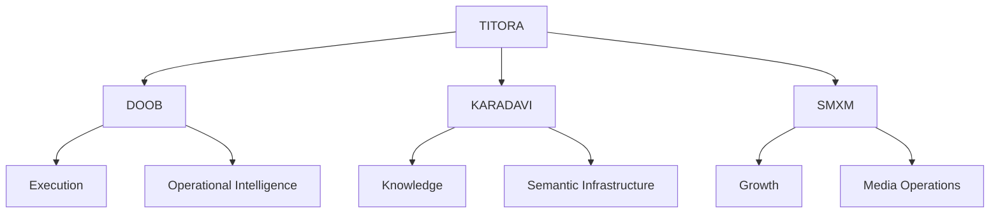

# TITORA Architecture

## Purpose

TITORA is the ecosystem-level coordination and documentation layer for a set of independently evolving digital systems.

The architecture is intentionally **federated** rather than monolithic.

## System boundaries

### DOOB

DOOB is responsible for growth intelligence, orchestration, signals, goals, providers, and execution workflows.

Its architectural concern is turning operational intent into observable execution.

### KARADAVI

KARADAVI is responsible for structured knowledge, entities, relationships, semantic context, and editorially controlled knowledge publishing.

Its architectural concern is turning information into durable, connected knowledge.

### SMXM

SMXM is responsible for growth and media operations.

Its architectural concern is distribution, marketing workflows, media execution, and growth infrastructure.

## TITORA's responsibility

TITORA should not become a shared dumping ground for implementation code.

Its responsibilities are:

- ecosystem architecture
- cross-system boundaries
- shared terminology
- architecture decisions
- operational conventions
- public documentation

## Cross-system rules

### Loose coupling

Systems should communicate through explicit contracts rather than depending on each other's internal implementation.

### Ownership

Every persistent piece of data should have a clear owning system.

### Idempotency

Automated operations should be safe to retry where practical.

### Observability

Important operations should expose enough state to understand what happened, why it happened, and whether it completed successfully.

### Human control

Actions with significant external or irreversible effects should have explicit approval or safety boundaries.

### Replaceability

External providers should sit behind stable interfaces where provider substitution is a realistic requirement.

## Architecture evolution

Change architecture when the current boundary creates measurable operational, reliability, security, or maintenance problems.

Avoid centralizing functionality merely to reduce short-term duplication.

When a cross-system decision materially changes boundaries or contracts, document it as an Architecture Decision Record.
